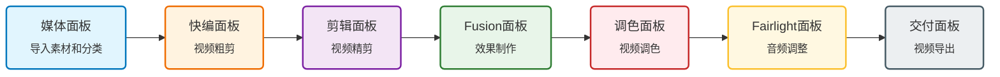

## 项目管理器面板

打开达芬奇就会出现的面板，每一个视频的工程都可以在这个面板创建和管理。

### 创建工程

- 法1: 点击“新建项目”按钮
- 法2: 双击“未命名项目”

⚠️ 创建项目后应立即按下`Ctrl + S` / `Cmd + S`进行项目的命名和保存。

**重要设置**

首次使用达芬奇，需要进行两个重要设置：

`用户面板`的`UI设置`可以将语言更改为中文：

`用户面板`的`项目保存和加载`勾选上`实时保存`和`项目备份`（新版本还有时间线备份，用于撤销/回溯操作，可一并勾选上）：

## 面板

老版本：

新版本：

### 流程图

可以看出，达芬奇的工作流就是一条线，并不复杂。

### 媒体面板
